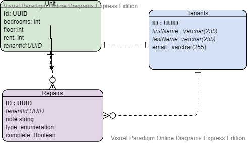

# The TRiiBE - Backend Assessment


## Overview

This coding assignment is an opportunity for the candidate to flex their backend skills and showcase known best practices.

## The Assignment

The owner of a multi-tenant apartment building has approached you to design and develop management software to help oversee their building and its tenants. Your job is to implement the backend of the application using a database and creating an API.

## Features

### Requirements

* The application is made using Node/ES6.
* The following options are preferred for the database: MySQL, Postgres, MongoDB
* The database should contain tables for the following models
	- Tenants
	- Apartment units
* There should be a relation between the models
* The API should contain CRUD (Create-Read-Update-Delete) routes for each model
* The API should be able to retrieve the current tenant of any given unit
* The API should be able to retrieve the info of any given tenant or unit

### Nice-to-haves (Optional)
* Maintenance request tracking
* Testing
* Anything else you can think of




## How to run and install

1. Clone repo git clone git@github.com:zaynaib/devmynd_test.git
2. Install npm dependencies ```npm install```
3. Create a sql database called **apartments**
4. In the terminal run nodemon `server.js`
5. Test Routes in postman
